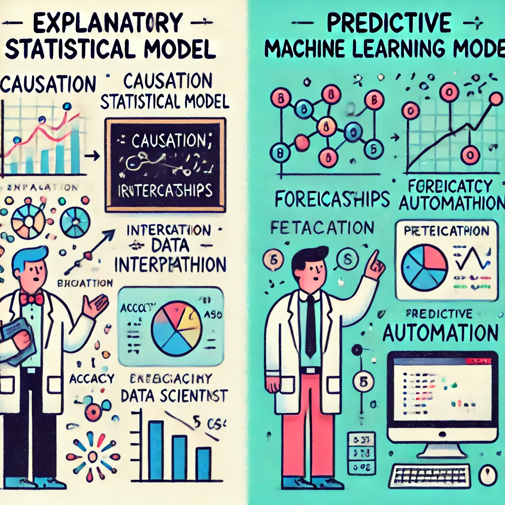
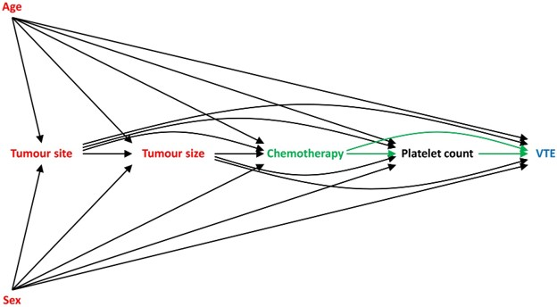
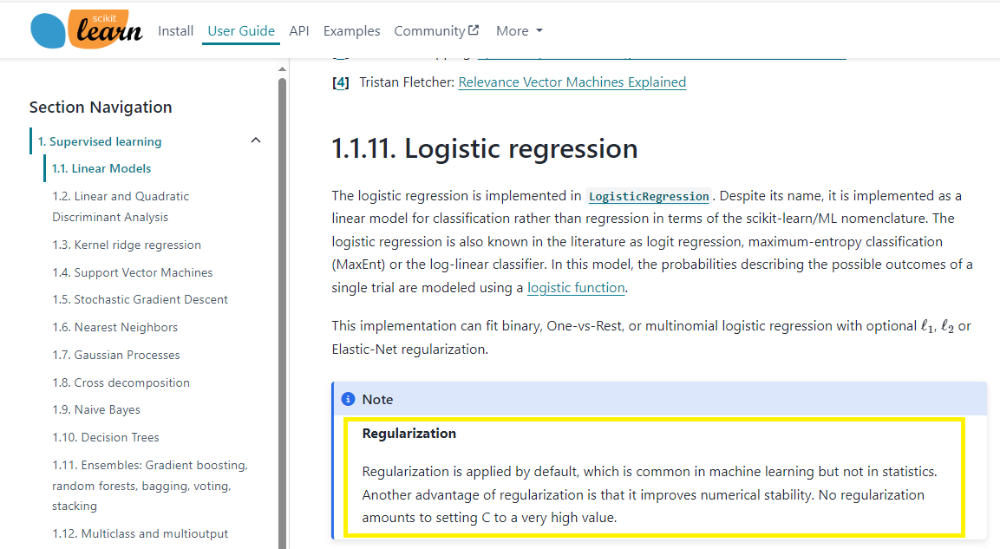

```{r setup, include=FALSE}
library(ragg)

ragg_png = function(..., res = 192) {
  ragg::agg_png(..., res = res, units = "in")
}

#library(Cairo)

library(citr)
library(ggplot2)
library(ggforce)

options(htmltools.dir.version = FALSE)


knitr::opts_chunk$set(fig.width=5.6, fig.height=2.8, fig.align = "center", dev = "ragg_png", fig.ext = "png", dpi=300
                      #dev.args = list(png = list(type = "cairo"))
                      , fig.retina=3) 


## Set ggplot defaults
theme_set(
  theme_bw() +
    theme(legend.position = "right",
          plot.subtitle = element_text(face = "italic"
                                       , family = "sans"
                                       , size=10))
)


alpha <- 5.4776
X<-c(1,2,2)
Y<-alpha + (X * 1.2507)
Y[2] <- Y[1]
dt2  <- data.frame(X,Y)

triangle<- data.frame(X=c(1.5,2.13,0),
Y = c(6.3, 7.3, 6.2), 
#value=c("1", "1.5", "2"),
label= c("1", "\u03B2", "\u03B1" ))

library(reticulate)

use_virtualenv("exp_or_pred")

```


.pull-left[

<br><br>

# To explain or predict:
### How different modelling objectives change how you use the same tools

<br><br>

__Chris Mainey - BSOL ICB__
`r icons::icon_style(icons::fontawesome("envelope"))` [c.mainey1@nhs.net](mailto:c.mainey1@nhs.net)
`r icons::icon_style(icons::fontawesome("github"))` [chrismainey](https://github.com/chrismainey)
`r icons::icon_style(icons::fontawesome("linkedin"), fill = "#005EB8")`  [chrismainey](https://www.linkedin.com/in/chrismainey/)
`r icons::icon_style(icons::fontawesome("orcid"), fill = "#A6CE39")` [0000-0002-3018-6171](https://orcid.org/0000-0002-3018-6171)
]

.pull-right[

<p style="text-align:center;font-weight:bold;">
<br>
Generated by Chat-GPT and Dall-E 3.  <br>
Any thoughts on the prediction error here? </p>
]

---

# Overview


This talk draws heavily on Professor Galit Shmueli's 2010 paper of the same name:


__Shmueli, G. (2010), To Explain or To Predict?, Statistical Science, vol 25 no 3, pp. 289-310.__

<br>

--

>"Since all models are wrong, the scientist must be alert to what is importantly wrong. It is inappropriate to be concerned about mice when there are tigers abroad"
___Box (1976)___

--

<br><br><br>
<center><h2>
What is your question?
</h2></center>

???

Through out this, keep asking yourself: what is your question?

---

# The two broad classes of DS/modelling question:


## Explain

* How does an explanatory variable(s) relate to an outcome?
* We might consider two main groups:
  * Description
  * Causal Inference / Counter factual analysis

--

## Predict

* How can predictor variable(s) predict an outcome?
* At future time points or in different context?

<br>

__You can use many of the same models to fit in either context, but how you do it is different!__

???
Prof. Shmueli's paper laments that statisticians had almost exclusively on 'explanatory' models.

With the increasing accessibility of Data Science and Machine Learning, the focus of many
modern practitioners has swung the other way.  

Some of you may always be approaching a model as a prediction question.

What I'm presenting here today is fairly agnostic to your approach, be it bayesian / frequentist / whatever.

---

# Grounding

$$\mathcal{Y} = \mathcal{F(X)}$$
+ Imagine that $\mathcal{X}$ ___causes___ $\mathcal{Y}$ through some function: $\mathcal{F}$

--
+ $\mathcal{F}$ is a theoretical model, set of statements, path model etc.

--
+ To model with data, we need to use measurable variables

$$E(Y) = f(X)$$

--

## Our modelling goals are
+ __Explanatory__: using various $f$ to estimate $\mathcal{F}$, using $X,Y$
+ __Predictive__: estimate new values of $Y$, using $f(X)$

.footnote[
Shmueli, G. (2010), http://www.jstor.org/stable/41058949
]


???

...don't be scared, it's not that bad...

We are trying to model how X causes something, without being constrained by what data we have.
This can be concepts such as Y = depression, and F(x) could be things like: anxiety, past trauma, physical health, stress... etc.
We can't measure them directly, so 

---

# Example of a Causal Explanatory model

+ Directed Acyclic graph (DAG)

<center>

</center>

.footnote[Resued from: Arnold et al. Int J Epidemiol, Volume 49, Issue 6, December 2020, Pages 2074–2082, https://doi.org/10.1093/ije/dyaa049]


???
What do I mean by 'causes?'  It's not the same as 'associated with'.  There is an 'exposure' to 'outcome' effect, and a temporal element: i.e. exposure before outcome.
This DAG is hypothesising the causal relationship between chemotherapy and venous thromoembolism (VTE)

The arrows indicator the direction of causal relationships. Age, sex, tumour site and tumour size are confounding this relationship and should be adjusted for in a model, but platelet count is a mediator and should not.

---
# Simple Example: 


We will use an example I sourced from Kaggle, related to the paper: 

>Chicco, D., Jurman, G. Machine learning can predict survival of patients with heart failure from serum creatinine and ejection fraction alone. _BMC Med Inform Decis Mak_ __20__, 16 (2020). https://doi.org/10.1186/s12911-020-1023-5

>https://www.kaggle.com/datasets/andrewmvd/heart-failure-clinical-data/data

--

+ Data related to heart failure
+ Paper tests various prediction methods to see if albumin and serum creatinine alone can predict death.
+ Any modelling apporach would be more more extensive than the example here.

<br><br>

--

###I will be using logistic regression in both context

???

Despite talking about regression models a lot, I know they are not the most straight-forward thing, and you may never have encountered them.  

They are a foundation of many mode complex models, but so I'll try and do regression 2 minutes


---

## Regression in 2 minutes...

```{r lmsetup, include=FALSE}
set.seed(222)
x <- rnorm(50, 10, 4)
y <- runif(50, min = 0.5, 10) + (1.25*x)
z <- predict(lm(y~x))
set.seed(222)
library(ggplot2)
```

```{r lm1, echo=FALSE, fig.align="center"}
x <- rnorm(50, 10, 4)
y <- runif(50, min = 0.5, 10) + (1.25*x)

a<-ggplot(data.frame(x,y,z), aes(x=x,y=y))+
  geom_point(col="dodgerblue2", alpha=0.65) + 
  scale_y_continuous(limits=c(5,30))
a
```

---
## Regression models (1)

```{r lm3, echo=FALSE, fig.align="center", fig.retina=2, message=FALSE, warning=FALSE}
z <- lm(y~x)
print(a<- a + geom_smooth(method="lm", col="red", linetype=2,fullrange=TRUE, se=FALSE))
```


$$y= \alpha + \beta x + \epsilon$$

---

## Regression models (2)
 
```{r lm35, echo=FALSE, fig.align="center", fig.retina=2, message=FALSE, warning=FALSE}
z <- lm(y~x)
print(a + geom_mark_circle(aes(y=5.4776 , x=0), col = "darkgoldenrod2", linetype="dashed",
             size=1.2)+
        geom_polygon(aes(x=X,y=Y), fill=NA, col = "darkgoldenrod2", linetype="dashed",
             size=1.2 ,data=dt2) +
        geom_label(aes(x=X, y = Y, label=label), data=triangle)+
        coord_cartesian(xlim = c(0,3),ylim= c(5,10))
        )
```

---

# Regression equation

<br>

$$\large{y= \alpha + \beta_{i} x_{i} + \epsilon}$$
<br>
.pull-left[
+ $y$ - is our 'outcome', or 'dependent' variable
+ $\alpha$ - is the 'intercept', the point where our line crosses y-axis
+ $\beta$ - is a coefficient (weight) applied to $x$ 
]
.pull-right[
+ $x$ - is our 'predictor', or 'independent' variable
+ $i$ - is our index, we can have $i$ predictor variables, each with a coefficient
+ $\epsilon$ - is the remaining ('residual') error
]


---
# The Generalized Linear Model (GLM):

For distributions in the exponential family, GLM allows the linear model to relate to response through a function:

$$\large{g(\mu)= \alpha + \beta_{i} x_{i}}$$
<br>
+ Where $\mu$ is the _expectation_ of $Y$, 
+ $g$ is the link function - related to each

--

So, for logistic regression, the link function is 'logit' or the log odds of the event.

---

# Explanatory model - R

```{r exp1_r_setup, message=FALSE, warning=FALSE, include=FALSE}
library(readr)
heart_failure_dt <- read_csv("data/heart_failure_clinical_records_dataset.csv")

```

```{r mod1_exp}
r_model_exp <- glm(DEATH_EVENT ~ serum_creatinine + ejection_fraction
              , data=heart_failure_dt
              , family = "binomial")

summary(r_model_exp)
```

---

# Explanaory model - Python

```{python pd_setup, include=FALSE}
import pandas as pd
import statsmodels.formula.api as smf

heart_failure_pd = pd.read_csv('./data/heart_failure_clinical_records_dataset.csv')
py_model1_exp = smf.logit("DEATH_EVENT ~ serum_creatinine + ejection_fraction", data=heart_failure_pd).fit()
py_model1_exp_summary = py_model1_exp.summary()
```

```{python py_exp_1, echo=TRUE, eval=FALSE, messages=FALSE, warnings=FALSE}
import statsmodels.formula.api as smf

py_model1_exp = smf.logit("DEATH_EVENT ~ serum_creatinine + ejection_fraction", data=heart_failure_pd).fit()
```

```{python py_exp_1_output, results='html'}
print(py_model1_exp_summary)
```


---
# Testing Fit

* Significance of coefficients in our model summaries
* Assumption of regression being met - _a topic for another day_

```{r auc_exp_r, message=FALSE, warning=FALSE}
library(ModelMetrics)
auc(r_model_exp)

```

```{python auc_exp_py}
from sklearn import metrics
py_auc = metrics.roc_auc_score(heart_failure_pd['DEATH_EVENT'], py_model1_exp.fittedvalues)
print(py_auc)
```

--

### Is over-fitting an issue?

_No, not if your goal is explanatory_

??? 
We are interested in whether our model makes a good job of estimating F(x).
Do the measured variables (and their coefficients) have a relationship with Y?
Might use the AUC / ROC as a measure of variance explained by the model.
BIC is considered a good measure of fit.

In a GLM like this, it's worth considering the error around the intercept, as there's no separate error term. Is there still a lot of unobserved variance?

---
# Why `statsmodels` ?

<center></center>

.footnote[https://scikit-learn.org/stable/modules/linear_model.html#logistic-regression]

???

Two things here: Scikit-learn is set up to tune predictive models.  It, by default, uses the ridge penalty to reduce overfitting/improve predictive accuracy.  Once you apply a penalty, you can't directly interpret the coefficient, or the error as the degrees-of-freedom are effected.  E.g. if you penalise 20% of the coefficient's value, how to you understand 80% of two predictors on the degrees of freedom?

You can force scikit learn to do it without a penalty (shown next), but why not use something geared to the purpose?
For those who learnt R/Python modelling using Caret or Scikit learn, you need to appreciate that you are building a predictive model, not an explanatory model.

---

# Predictive Model - R

```{r r_rpred_2}
heart_failure_dt$sc_serum_creatinine <- scale(heart_failure_dt$serum_creatinine)
heart_failure_dt$sc_ejection_fraction <- scale(heart_failure_dt$ejection_fraction)

trainIndex <- caret::createDataPartition(heart_failure_dt$DEATH_EVENT
                                         , p = .8
                                         , list = FALSE
                                         , times = 1)

Train <- heart_failure_dt[ trainIndex,]
Test  <- heart_failure_dt[-trainIndex,]

r_model_pred <- glm(DEATH_EVENT ~ sc_serum_creatinine + sc_ejection_fraction
              ,  data=Train
              , family = "binomial")

predictions <- predict(r_model_pred, newdata=Test, type="response")
# Model performance metrics

auc(Test$DEATH_EVENT, predictions)
```

---

# Predictive model - Python

```{python py_pred_model, include=FALSE, messages=FALSE, warnings=FALSE}
from sklearn.model_selection import train_test_split
from sklearn.preprocessing import StandardScaler
from sklearn.linear_model import LogisticRegression

sc= StandardScaler()
X = sc.fit_transform(heart_failure_pd[['serum_creatinine', 'ejection_fraction']])

y = heart_failure_pd[['DEATH_EVENT']]
X_train, X_test, y_train, y_test = train_test_split(X,y , test_size = 0.2)

log_reg = LogisticRegression(penalty = None).fit(X_train,y_train)

y_pred = log_reg.predict_proba(X_test)
```


```{python py_pred_model_show1, warnings=FALSE, messages=FALSE, eval=FALSE}
from sklearn.model_selection import train_test_split
from sklearn.preprocessing import StandardScaler
from sklearn.linear_model import LogisticRegression

sc= StandardScaler()
X = sc.fit_transform(heart_failure_pd[['serum_creatinine', 'ejection_fraction']])

y = heart_failure_pd[['DEATH_EVENT']]
X_train, X_test, y_train, y_test = train_test_split(X,y , test_size = 0.2)

log_reg = LogisticRegression(penalty = 'None').fit(X_train,y_train)
```
```{python py_pred_model_show2, warnings=FALSE, messages=FALSE}
y_pred = log_reg.predict_proba(X_test)

py_auc = metrics.roc_auc_score(y_test, y_pred[:,1])
print(py_auc)
```

---

# What is important in assessing the fit:

.pull-left[

### Explanation
* Plausible relationship - DAG
 * Estimating $\mathcal{F(X)}$ through modelling $f(X)$
 * Interpretability
* Minimising bias
* Performance on the whole dataset
* Feature engineering should be logically consistent with relationship
* Scale/centre predictors for interpretation reasons

]

.pull-right[

### Prediction
* Prediction error on new data (new sample, hold-out/test set, cross-validation)
* Bias / Variance trade-off:  happy with some bias to reduce variance
* Less concerned with interpreting coefficients / predictors
* Multicollinearity therefore less of a problem
* Feature engineering can be extensive and esoteric
* Scale/centre predictors as good practise for computation reasons

]

???

So you might leave multiple 'non-significant' predictors in an explanatory model, as they are rational and all effects conditional on each other.

You might be happy with a 'wrong' model for in prediction, if it gives better predictions.

---
# Explain or predict Bingo (1):

<br><br><br>

.big[Forecasting attendances at an Emergency Department]

<br><br>

--

## Predict!

---

# Explain or predict Bingo (2):

<br><br><br>

.big[What drives people to attend an Emergency Department?]

<br><br>

--

## Explain!


---
# Explain or predict Bingo (3):

<br><br><br>

.big[What is a person's risk of attending an Emergency Department?]

<br><br>

--

## It depends:...  is it about the person's individual risk based on explanatory factors, the best prediction you can make, or is it for risk-adjustment?

---
# Explain or predict Bingo (4):

<br><br><br>

.big[Did our new UTC pathway decrease how often people attend the Emergency Department?]

<br><br>

--

##Explain!


---

# Explain or predict Bingo (5):

<br><br><br>

.big[Building a Large Language Model to answer questions as a chatbot]

<br><br>

--

## Predict!

---
# Explain or predict Bingo (6):

<br><br><br>

.big[Modelling long-term population health-state changes]

<br><br>

--

## It depends:...  are you testing what causes it, or predicting future states of the population?

---

# Summary

.pull-left[

## Consider what the purpose of your model is:

* What is your question?

* Is it predictive or explanatory?

* Are you using the right modelling framework?

* Are you doing anything that is incompatible with the framework you've identified?
]

.pull-right[
<br><br><br>
> "With great power comes greate responsibility"
- Stan Lee (via Spiderman's Uncle Ben)

]

---

# References

Arnold, K.F. et al. (2020) ‘Reflection on modern methods: generalized linear models for prognosis and intervention—theory, practice and implications for machine learning’, _International Journal of Epidemiology_, __49(6)__, pp. 2074–2082. Available at: https://doi.org/10.1093/ije/dyaa049.

Box, G.E.P. (1976) “Science and Statistics.” _Journal of the American Statistical Association_ __71__, no. 356: 791–99. https://doi.org/10.2307/2286841.


Chicco, D. and Jurman, G. (2020) ‘Machine learning can predict survival of patients with heart failure from serum creatinine and ejection fraction alone’, BMC Medical Informatics and Decision Making, 20(1), p. 16. Available at: https://doi.org/10.1186/s12911-020-1023-5.


Hernán, M. A., Hsu, J. and Healy, B. (2019) ‘A Second Chance to Get Causal Inference Right: A Classification of Data Science Tasks’, _CHANCE_, __32(1)__, pp. 42–49. doi: 10.1080/09332480.2019.1579578.


Shmueli, G. (2010) 'To Explain or to Predict?' _Statistical Science_ __25__, no. 3 : 289–310. http://www.jstor.org/stable/41058949.


---


## Predictive Model - R bonus (ridge regression, like Scikit learn assumes you want...)

```{r r_ridge, message=FALSE, warning=FALSE}
heart_failure_dt$sc_serum_creatinin <- scale(heart_failure_dt$serum_creatinine)
heart_failure_dt$sc_ejection_fraction <- scale(heart_failure_dt$ejection_fraction)

trainIndex <- caret::createDataPartition(heart_failure_dt$DEATH_EVENT
                                         , p = .8
                                         , list = FALSE
                                         , times = 1)

Train <- heart_failure_dt[ trainIndex,]
Test  <- heart_failure_dt[-trainIndex,]

x <- model.matrix(DEATH_EVENT~sc_serum_creatinin+sc_ejection_fraction, Train)[,-1]
y <- Train$DEATH_EVENT

library(glmnet)
# Cross validate to get best lambda (shrinkage)
cv <- cv.glmnet(x, y, alpha = 0, family="binomial")

ridge1<-glmnet(x,y, alpha=0, lamda=cv$lambda.min, family="binomial")

# Make predictions on the test data
x.test <- model.matrix(DEATH_EVENT~sc_serum_creatinin+sc_ejection_fraction, Test)[,-1]

predictions <- predict(ridge1, newx=x.test, type="response") |> as.vector()

ModelMetrics::auc(Test$DEATH_EVENT, predictions)
```
